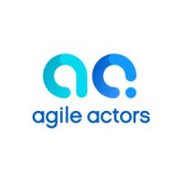
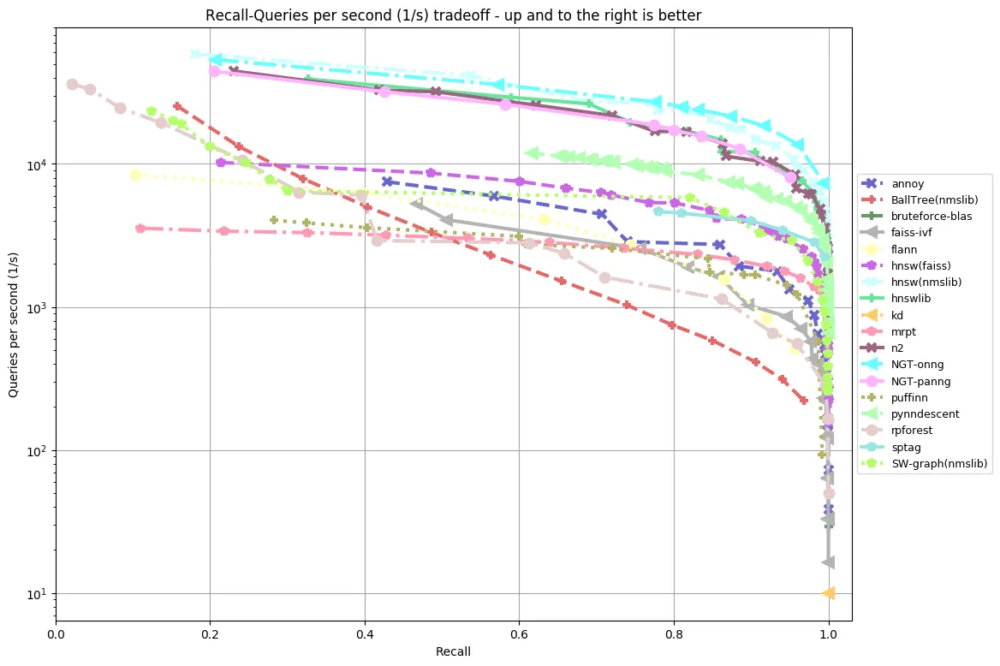

# **Vector DBs (Part 2)**

_Presenter_ : 

Vasileios (Vasilis) Anagnostopoulos

---

# What we will discuss

* Approximate Nearest Neighbors vs k-Nearest Meighbors
* Performance tricks (Classical Vector DB indexing)
* Structured search (Modern Vector DB indexing)
* How to choose vector indexing strategy
* How to choose Vector DB

---

# ANN 1/2

* For **N** vectors of dimensionality **d** we need O(**N** * **d**) operations for similarity. **b**-times this for top-**b**. 
    
    If **N** = O(10^9) and **d** = O(10^3)  we talk about O(10^12) ops

__Results__ : Reduced QPS (Queries per second) also cannot cache to RAM

* What is the solution? => We trade QPS for Recall (aka Precision)
* Precision = `Percentage of ANN thar are NN`
---

# ANN 2/2

---

# Performance tricks 0/5

* If dataset is small => Just use flat index (exact NN)
* Greedy search of query vector against **N** vectors.
---

# Performance tricks 1/5

* If dataset is not small let's try the IVF Trick
* Use **K**-means to split vectors to **K** clusters.
* During querying, use **a**-probing :
    > Which are the closest **a** clusters
* Now use greedy search for less vectors: 
    > **N_effective** = **a** * **N** / **K** 
*  We may get lucky and **N_effective** is small 🤞
---

# Performance tricks 2/5

* Take vectors and chop to **M** pieces
* Do **K**-means to each piece separately 
* Replace pieces with cluster centers aka PQ trick
* When querying chop query vector to **M** pieces
* Compute piece distance from all cluster centers. 
* Now you have a LUT
* Search takes **N** * **M** lookups. 💥

---

# Performance tricks 3/5

* Combine IVF + PQ
* Do **K1**-means
* Center vectors to 0 by subtracting cluster center 
* Do PQ with **M** chopping + **K2**-Means 
* Use IVF trick
* Search takes **N_effective** * **M** times. 💥💥

---

# Performance tricks 4/5

* Accelerate similarity calculation through BQ trick
* Assume normalized vectors **v** (cosine distance)
* Create binary surrogate vectors **w** 
    > 1 positive component else 0
* Quantize original **v** as  **v'** = 2 * **w** - (1,...,1)
* Similarity of quantized vectors is  
    > <**v1'**, **v2'**> = 1 - 2 * sum(**w1** `XOR` **w2**) / **d**
* SIMD friendly, dramatic memory reduction 💥💥💥

---

# Performance tricks 5/5

* Previous methods can reduce recall. (Obviously)
* Insted of **k**-NN use previous methods with **k_overfetch**-NN
* In the overfetch subset, do **k**-NN with real distances
* Only **k_overfetch** * **d** penalty
* Benchmark to find smallest **k_overfetch**

---

# Structured search

* **Annoy** uses a binary search on a *kdd* like tree but with separating hyperplanes instead of randomly chosen components.
* **HNSW** uses a hierarchy of graphs constructed in a skip-list like manner. Construction and searching in the hierarchy of skeleton graphs work the same.
* While good for medium sized datasets suffer slow preprocessing, big memory consumption.
* Both can be exact with proper tuning, like in the classical theory.
---

# How to choose vector indexing strategy

* Assume big dimensionality
* Small datasets => Flat index with optional BQ (Cosine) / PQ (euclidean)
* Cosine / Euclidean embedding, medium dataset => HNSW
* Cosine embedding, huge dataset => BQ + HNSW
* Euclidean embedding, huge dataset => PQ + HNSW
* Can try the classical methods if they work

---

# How to choose vector DB 1/2

* PG/MariaDB have vector search
* Typesense has all the goodies for text and semantic search
* Weaviate is more performant 
* Typesense is typo tolerant
* Both can do geo-search and image seacrh
* Weaviate can do multiple embeddings

---

# How to choose vector DB 2/2

* Alibaba zvec
* Vectorlite for SQLite
* BM25 + something of the above